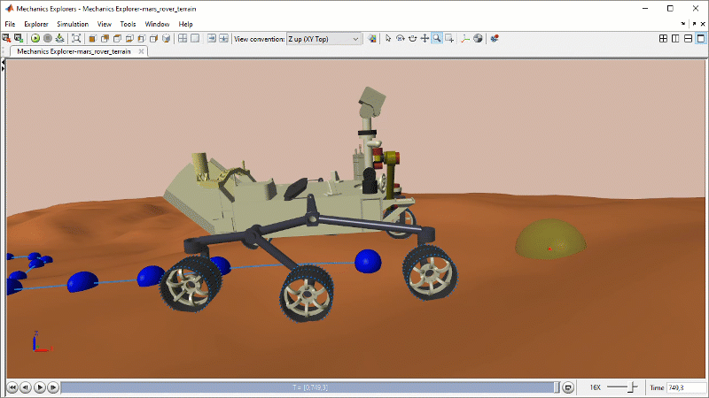
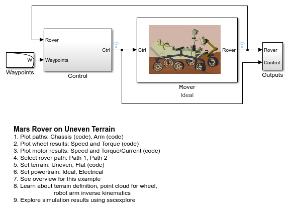
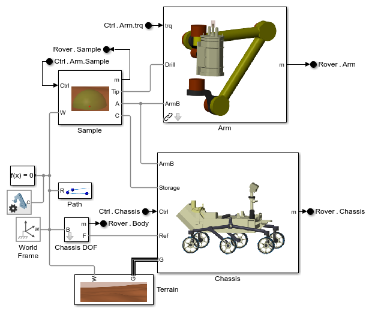
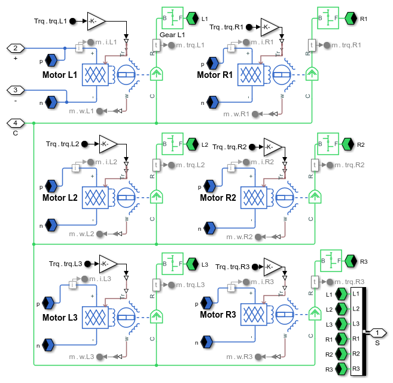

# **Mars Rover Model in Simscape&trade;**
Copyright 2021-2022 The MathWorks, Inc.

This example models a mars rover that navigates a path on uneven terrain 
to retrieve a sample.  
* **Contact forces** are modeled between the six driven wheels and the terrain. 
* **Path following and speed control algorithms** adjust the wheel steer angles 
  and speeds to guide the rover to the sample.
* **Inverse kinematic analysis** is used to plan the rover arm joint angle
  trajectories that will enable the arm to acquire and store the sample.
* **Electric motors** can be used to estimate rover power consumption.

Open the project file Mars_Rover_Terrain.prj to get started.

## **Mars Rover Animation Clip**

## **Mars Rover and Control System**

## **Mars Rover Chassis and Arm Systems**

## **Mars Rover Motors and Battery**

To learn more about modeling and simulation with Simscape, please visit:
* [Simscape Getting Started Resources](https://www.mathworks.com/solutions/physical-modeling/resources.html)
* Product Capabilities:
   * [Simscape&trade;](https://www.mathworks.com/products/simscape.html)
   * [Simscape Driveline&trade;](https://www.mathworks.com/products/simscape-driveline.html)
   * [Simscape Electrical&trade;](https://www.mathworks.com/products/simscape-electrical.html)
   * [Simscape Fluids&trade;](https://www.mathworks.com/products/simscape-fluids.html)
   * [Simscape Multibody&trade;](https://www.mathworks.com/products/simscape-multibody.html)

The rover chassis and arm uses files provided by 
[NASA](https://nasa3d.arc.nasa.gov/detail/M2020-Model-Rover-STLs512020) and
shall be used according to [NASA Media Usage Guidelines](https://www.nasa.gov/multimedia/guidelines/index.html). 
